## PATTERN PROBLEMS USING PYTHON

### Star Problems

    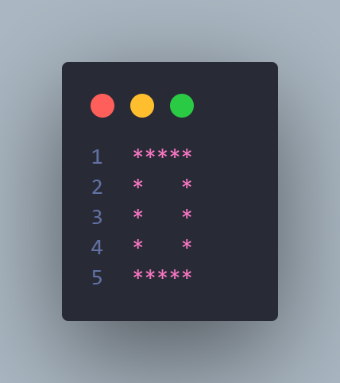
    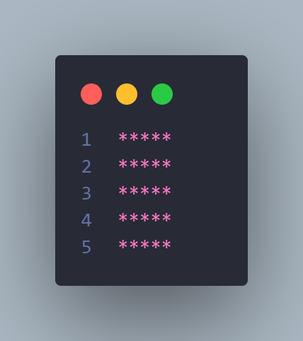
    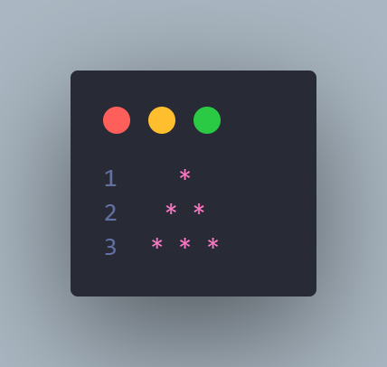
    
    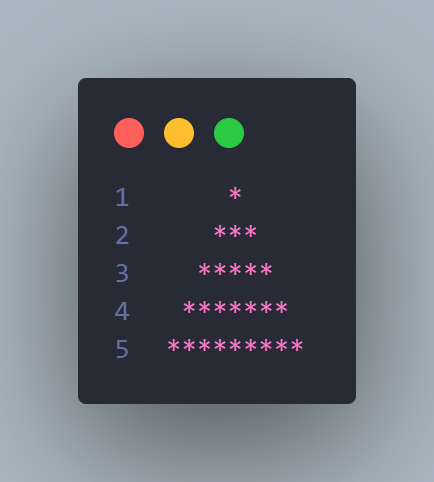
    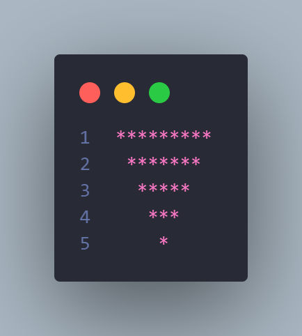
    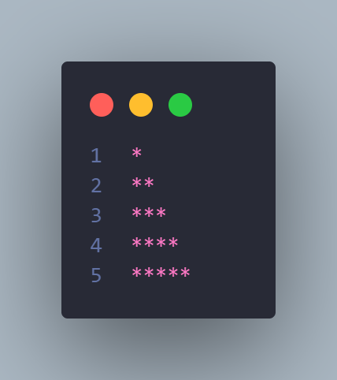
    
    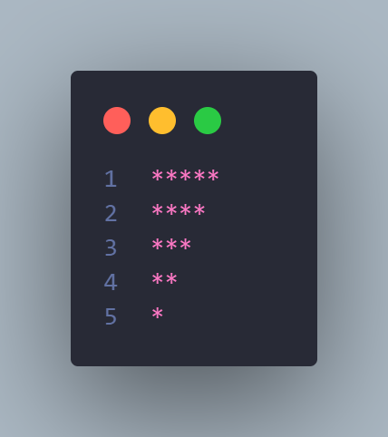
    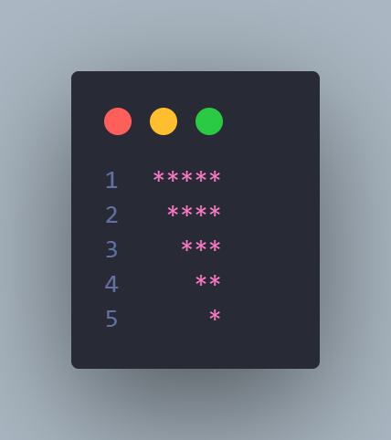
    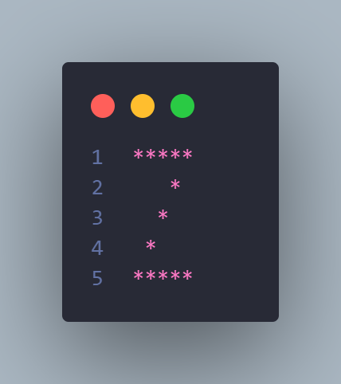

### NUMBER PATTERNS

    
    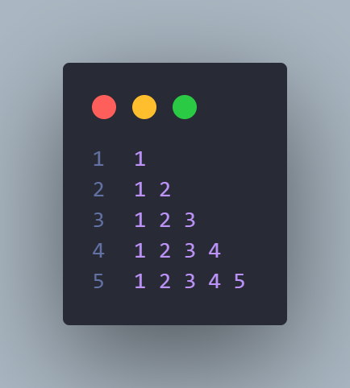
    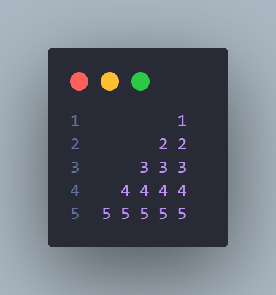
    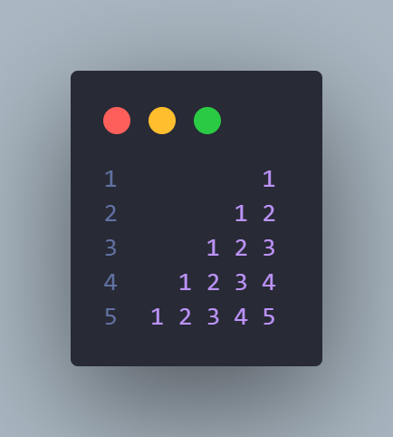
    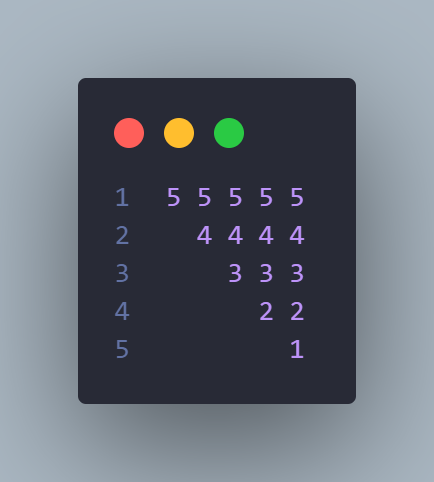
    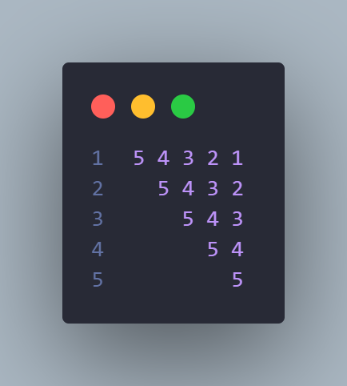
    
    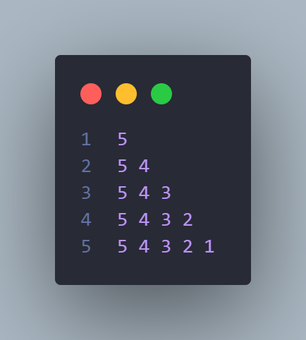
    
    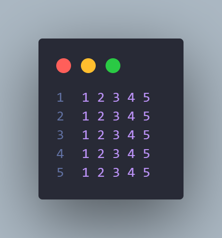
    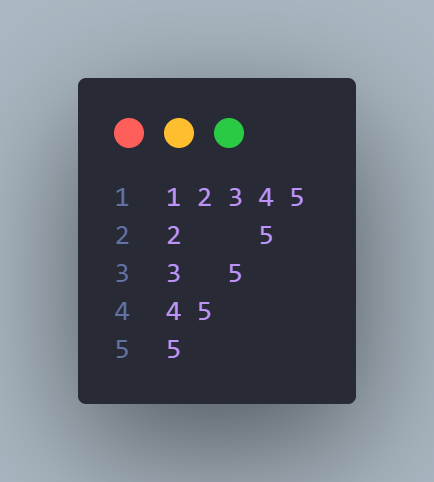
    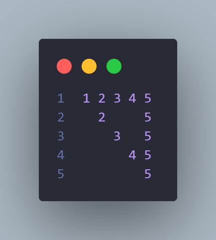
    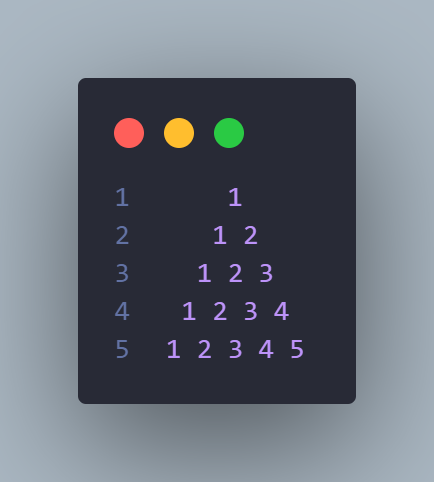
    

